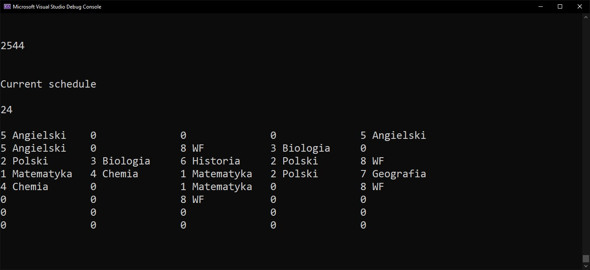

# 📅 Timetable Scheduling with Genetic Algorithm

## 🧬 Genetic Algorithm Overview

This software is based on the principles of a **genetic algorithm**, an advanced computational technique inspired by natural evolutionary processes. Genetic algorithms are widely used in artificial intelligence for solving complex optimization problems.

### 🔁 Core Components of the Genetic Algorithm:

- **Population of individuals:** Each individual represents a potential timetable solution.
- **Selection:** Individuals with better fitness scores are chosen to reproduce.
- **Crossover:** Combining features of two selected individuals to create offspring.
- **Mutation:** Introducing random changes in offspring to maintain genetic diversity.
- **Fitness Evaluation:** Each individual is evaluated by a fitness function that measures how well it satisfies the problem constraints.

This evolutionary cycle repeats over many generations until a satisfactory or optimal timetable is found, or a termination condition is met.

---

## 🎯 Application Objective

The goal of the program is to **automatically generate a timetable** that meets all predefined constraints and requirements.

### ✅ Constraints and Requirements:
- Classes can be scheduled only at specific times and days of the week.
- Each type of class has:
  - a maximum number of occurrences per week,
  - a limit on occurrences per day.
- The timetable must avoid:
  - gaps ("free periods") between classes,
  - days without any scheduled classes.

---

## 📈 Potential Use Cases

- School or university class scheduling
- Workforce shift planning
- Automated schedule generation based on multiple constraints

---

## 📸 Screenshots

